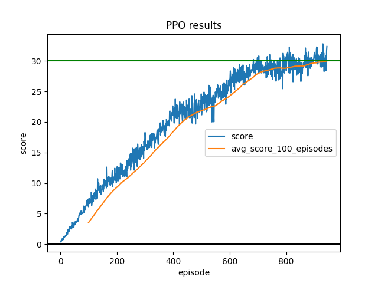

[image1]: https://user-images.githubusercontent.com/10624937/43851024-320ba930-9aff-11e8-8493-ee547c6af349.gif "Trained Agent"

## Project 2: Continuous Control

### Problem statement

![Trained Agent][image1]

In this environment, a double-jointed arm can move to target locations. A reward of +0.1 is provided for each step that 
the agent's hand is in the goal location. Thus, the goal of your agent is to maintain its position at the target 
location for as many time steps as possible.

The observation space consists of 33 variables corresponding to position, rotation, velocity, and angular velocities of 
the arm. Each action is a vector with four numbers, corresponding to torque applicable to two joints. Every entry in the
 action vector should be a number between -1 and 1.

For this implementation the second version of the unity environment is being used.
#### Goal
In particular, the agents must get an average score of +30 (over 100 consecutive episodes, and over
  all agents).  Specifically,
- After each episode, we add up the rewards that each agent received (without discounting), to get a score for each 
agent.  This yields 20 (potentially different) scores.  We then take the average of these 20 scores. 
- This yields an **average score** for each episode (where the average is over all 20 agents).

The environment is considered solved, when the average (over 100 episodes) of those average scores is at least +30. 

**Environment description**
```
Number of Visual Observations (per agent): 0
Vector Observation space type: continuous
Vector Observation space size (per agent): 33
Number of stacked Vector Observation: 1
Vector Action space type: continuous
Vector Action space size (per agent): 4

```

### Learning Algorithm

#### Actor-Critic Method
Actor-critic are a combination of policy-based and valued-based methods.
In actor-critic methods:
1. The critic estimates the value function.
2. The actor updates the policy distribution in the direction suggested
by the critic.

Both the actor and critic are generally deep neural networks. The critic measures the goodness of actions
and the actor controls the behaviour of the agent. Actor-critic methods require relatively lesser training samples and
are more stable.

#### Proximal Policy Optimization (PPO)
PPO is a actor-critic method that updates policies by taking the largest possible
step possible to improve performance, while keeping the new and old policies close(in terms of KL-divergence).
PPO is a family of first-order methods unlike TRPO, which is a complex second-order method.

In this code the clip variant of PPO is implemented. The PPO-clip variant neither has a KL-divergence term in the 
objective nor a KL-divergence constraint. Instead relies on specialized clipping in the objective function to remove 
incentives for the new policy to get far from the old policy.

PPO is an on-policy algorithm.


Here epsilon is a hyperparameter which roughly says how far away the new policy is allowed to go
from the old.

#### PPO for continuous action spaces

PPO can be used for continuous action spaces by modeling the actions as a diagonal normal distribution.
It means that the covariance matrix of actions will only have non-zero elements in the main diagonal.
The policy network now computes the mean per action value, instead of probability per action. We can either fix the 
covariance matrix or compute it using another neural network. In this implementation the covariance matrix is fixed.
 

#### Entropy 

To promote exploration often times a entropy loss term is added to the loss function. The more the entropy, the more random the policy is.
The contribution of entropy to loss can be controlled using a hyperparameter. 

However, in this code, entropy is not added to loss as we are sampling from normal distributions with unchanging variance 
and entropy of a normal distribution depends upon its variance only. 

### Code description

The code consists of the following packages and files:
- main.py: run this file to train or eval model.
- rlcc: package containing agent and model code.
- rlcc/agent.py: ppo agent code.
- rlcc/network: contains actor and critic classes.

### Hyperparameters

The following hyperparameters were used for training the ppo actor-critic submitted as the solution-
```
{
  "no_graphics": false,
  "steps_per_epoch": 20,
  "gradient_clip": 1,
  "gamma": 0.995,
  "clip_ratio": 0.2,
  "device": "cpu",
  "minibatch_size": 200,
  
}
```
Graphics are turned off to speedup training and gradient clip is set to 1 to prevent unstable behaviour due to huge gradients.
#### Neural Network Architecture

For this problem statement simple feedforward fully connected neural networks are used. ReLU is used as the activation function in this architecture as it tends show good convergence performance in practice. 
##### Actor Network

```
PPOActor(
  (network): Sequential(
    (0): Linear(in_features=33, out_features=64, bias=True)
    (1): ReLU()
    (2): Linear(in_features=64, out_features=64, bias=True)
    (3): ReLU()
    (4): Linear(in_features=64, out_features=4, bias=True)
    (5): Tanh()
  )
)
```
The output of the last layer is the **mean** of the **action distribution**. This mean is used to model a diagonal normal distribution from which actions are sampled and log probabilities are calculated.

Tanh is used in as the activation function in the last layer as ReLU smashes all negative values to zero. Also, tanh function constricts the activation in the range (-1, 1), which is good for our use case.
##### Critic Network
```
PPOCritic(
  (network): Sequential(
    (0): Linear(in_features=33, out_features=64, bias=True)
    (1): ReLU()
    (2): Linear(in_features=64, out_features=64, bias=True)
    (3): ReLU()
    (4): Linear(in_features=64, out_features=1, bias=True)
  )
)

```
The ouput of this neural network is the **state value** for the given input state.


### Result



Goal achieved in 994 episodes.

### Ideas for future work

- Trying other algorithms like DDPG, A3C, A2C etc.
- Explore early stopping on the basis of KL-divergence.
- Compare performance of PPO-Penalty vs PPO-Clip.